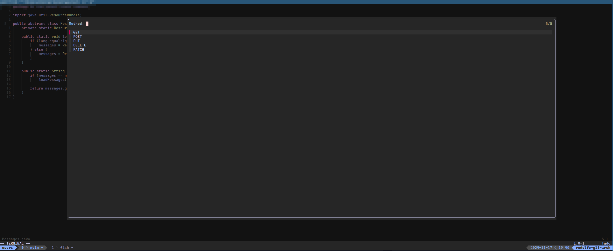
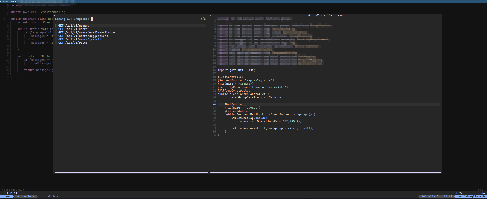

# fzf-spring.nvim

A fzf-lua picker to quickly api endpoint finder in spring(boot) project

## 🚀 Usage

Available user commands:
- `:Spring` - Open fzf picker to select the HTTP method to search.
- `:SpringGet` - Open fzf picker with all GET endpoints.
- `:SpringPost` - Open fzf picker with all POST endpoints.
- `:SpringPut` - Open fzf picker with all PUT endpoints.
- `:SpringDelete` - Open fzf picker with all DELETE endpoints.
- `:SpringPatch` - Open fzf picker with all PATCH endpoints.

## ✨ Features

> Select HTTP method to search



> Search endpoints



## 📦 Installation

```lua
-- lazy.nvim
    {
        "rodolfoinfantini/fzf-spring.nvim",
        dependencies = { "ibhagwan/fzf-lua" },
        config = function()
            local fzf_spring = require("fzf-spring")
            fzf_spring.setup()
            vim.keymap.set("n", "<leader>fs", fzf_spring.pick_spring, { silent = true })
            -- vim.keymap.set("n", "<leader>fs", fzf_spring.pick_get_mapping, { silent = true })
            -- vim.keymap.set("n", "<leader>fs", fzf_spring.pick_post_mapping, { silent = true })
            -- vim.keymap.set("n", "<leader>fs", fzf_spring.pick_put_mapping, { silent = true })
            -- vim.keymap.set("n", "<leader>fs", fzf_spring.pick_delete_mapping, { silent = true })
            -- vim.keymap.set("n", "<leader>fs", fzf_spring.pick_patch_mapping, { silent = true })
        end
    }
```

## ⚡️ Requirements

- [fzf-lua](https://github.com/ibhagwan/fzf-lua)
